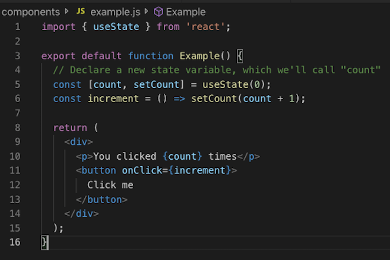
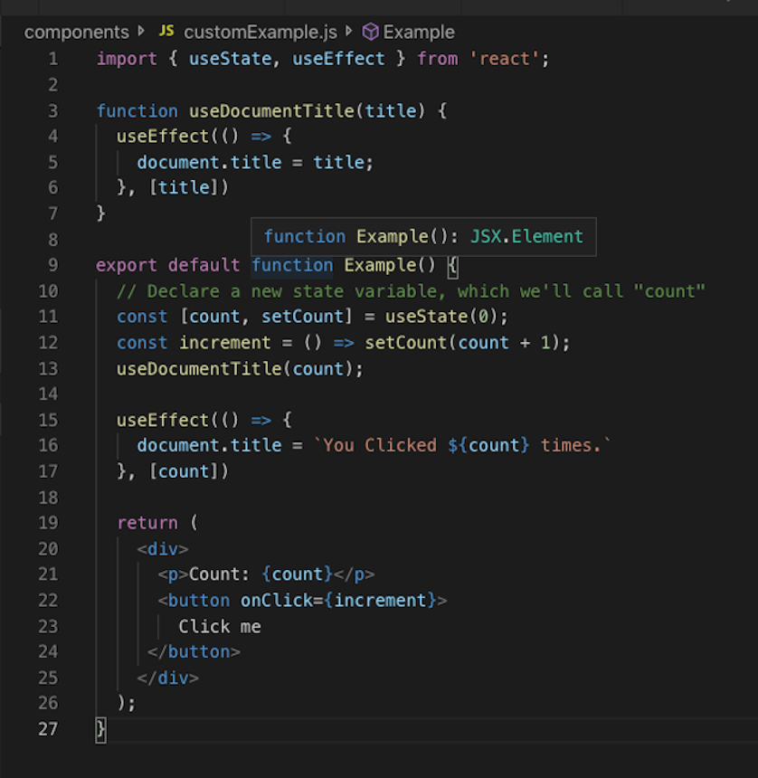

export { default as theme } from 'gatsby-mdx-theme';

import { Head, Appear, Notes } from 'mdx-deck';
import { Split, SplitRight } from 'mdx-deck/layouts'
import {
  FullScreenCode,
  Main,
  Section,
  SectionInverted
} from 'gatsby-mdx-theme';

import Example from './components/example';
import CustomExample from './components/customExample';
import {Col, Title} from './deck/Col';

---

export default Main

# 82.5 % cleaner code with <br /> React Hooks *

## _*Clean code amount subject to change_

<Notes>

  - 90% According to Dan "the man" Abramov
  - Great talk on the youtube

</Notes>

---

export default Section

<Col>

# About Me 
<ul>
  <Appear>
    <li>React ~3 years</li>
    <li>JavaScript ~5 years</li>
    <li>LAMP stack ~8 years</li>
  </Appear>
</ul>
</Col>

---

export default Section

<Col>

<Title>What are Hooks?</Title>

<br />

## _React proposal from Oct 2018_ 

<ul>
  <Appear>
    <li>Hooks let you reuse logic between components without changing your component hierarchy.</li>
    <li>Hooks let you split one component into smaller functions based on what pieces are related.</li>
    <li>Hooks let you use React without classes.</li>
  </Appear>
</ul>

</Col>

---

export default Section

<Col>

# Rules of Hooks #1 🤔

- Call Hooks at the "Top Level"
  - Don’t call Hooks inside loops, conditions, or nested functions

  ```jsx
  // 🔴 We're breaking the first rule by using a Hook in a condition
  if (name !== '') {
    useEffect(function persistForm() {
      localStorage.setItem('formData', name);
    });
  }
  ```

</Col>

---

export default Section

<Col>

# Rules of Hooks #2 :grimacing:

- Only Call Hooks from React Functions
  - Call Hooks from React function components
  - Call Hooks from "Custom Hooks"

</Col>

---

export default FullScreenCode

  ```jsx
  function Example() {
    // Declare a new state variable, which we'll call "count"
    const [count, setCount] = useState(0);

    return (
      <div>
        <p>You clicked {count} times</p>
        <button onClick={() => setCount(count + 1)}>
          Click me
        </button>
      </div>
    );
  }
  ```

---

export default Section

<Split>



<Example />

</Split>

---

export default Section

<Col>

<Title>What are custom hooks?</Title>

<br/>
<br/>

<Split>


## _"Custom hooks lets you extract component logic into reusable functions"_

</Split>

</Col>

---

export default FullScreenCode

  ```jsx
  function useDocumentTitle(){
    React.useEffect(() => {
      document.title = count;
    })
  }
  function Example() {
    // Declare a new state variable, which we'll call "count"
    const [count, setCount] = useState(0);
    useDocumentTitle(count);

    return (
      <div>
        <p>You clicked {count} times</p>
        <button onClick={() => setCount(count + 1)}>
          Click me
        </button>
      </div>
    );
  }
  ```

---

export default Section

<Split>



<CustomExample />

</Split>

---

export default Section

<Col>

# Demo time!  

## TodoMVC

</Col>

---
export default Section

<Col>

# &nbsp;The end

## ¿Questions ?
</Col>

---

export default SectionInverted

# References:

- https://reactjs.org/blog/2016/07/13/mixins-considered-harmful.html?utm_source=javascriptweekly&utm_medium=email
- https://github.com/reactjs/rfcs/blob/master/text/0068-react-hooks.md
- https://github.com/reactjs/rfcs/pull/68
- https://medium.com/@dan_abramov/making-sense-of-react-hooks-fdbde8803889
