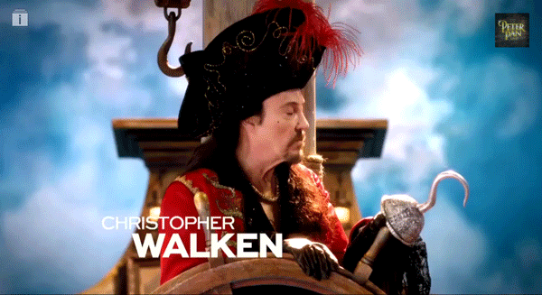

import {
  FullScreenCode,
  Main,
  Section,
  SectionInverted
} from 'gatsby-mdx-theme'

import { Split, SplitRight } from 'mdx-deck/layouts'

export default Section

# What are custom hooks?

<Split>

### Custom hooks lets you extract component logic into reusable functions.
</Split>

---

export default FullScreenCode

  function useDocumentTitle(title){
    useEffect(() => {
      document.title = title;
    }, [title])
  }

  function Example() {
    // Declare a new state variable, which we'll call "count"
    const [count, setCount] = useState(0);
    const increment = () => setCount(count+1);
    useDocumentTitle(count);

    useEffect(() => {
      document.title = `You Clicked ${ count } times.`
    }, [count])

    return (
      

        
Count: {count}

        <button onClick={increment}>
          Click me
        </button>
      

    );
  }